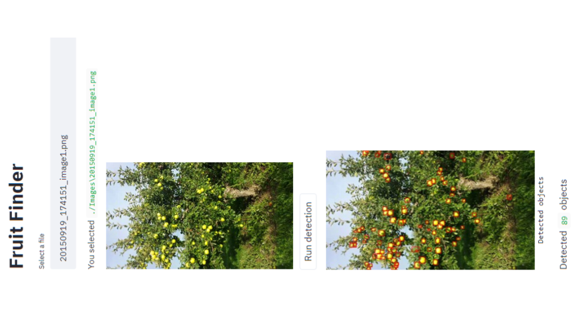

# FruitFinder

This is my personal Insight project. I developed a web app, FruitFinder, to help to simplify the business of micro farms or 
even everyone want to be proud of what he was able to grow in the 
backyard.

	

## Installation
To run the code:

* Setup a Python 3 environment
* Install other packages with the command:

> pip install -qr requirements.txt

* Clone this repository and enter it

> git clone https://github.com/mieva/INSIGHT_PROJECT.git

> cd FruitOnTreeDetection

The function: main_train.py runs all the steps of the 
fruit detection (data preparation, model selection, training, prediction  and
evaluation.) 

## WEB APP
The app is publicly at:

* http://13.57.192.202:8501

The code is in the WEB_APP forder.

